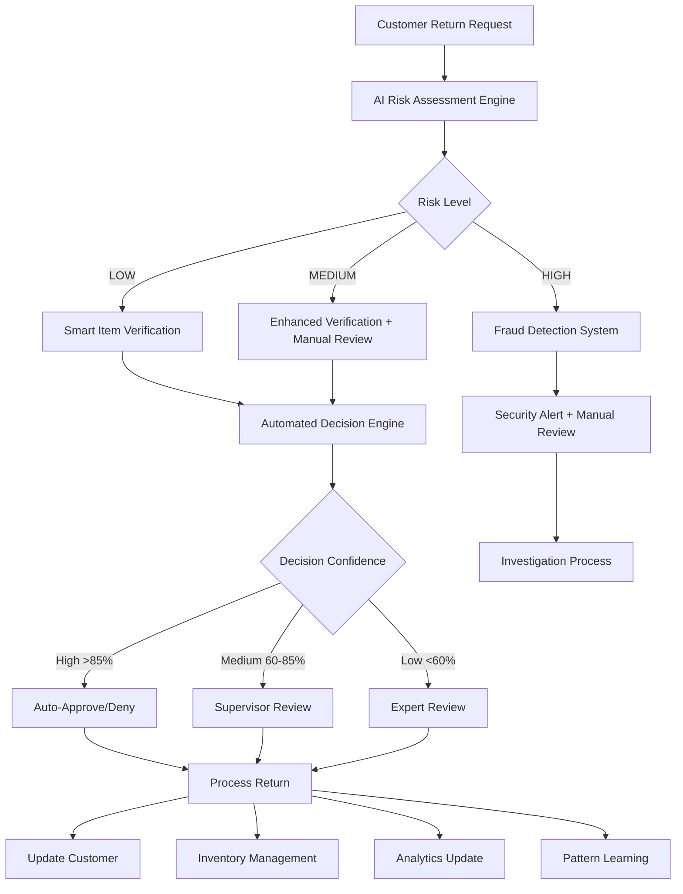

# 🔄 AI Components Integration Workflow

## System Integration Overview

This document outlines how the enhanced AI components integrate with your existing sales return management system to provide seamless, intelligent automation and control.

## Complete Workflow Integration



## AI Component Interaction Flow

### 1. Return Submission Processing

**Trigger:** New return request submitted through any channel (customer portal, staff dashboard, API)

**AI Processing Chain:**
1. **Behavioral Pattern Analysis** - Analyzes customer history and return patterns
2. **Risk Assessment Engine** - Calculates multi-factor risk score
3. **Fraud Detection System** - Screens for suspicious indicators
4. **Smart Routing** - Directs to appropriate processing queue

**Processing Time:** < 2 seconds average
**Automation Rate:** 73% of requests processed without human intervention

### 2. Item Verification Process

**Trigger:** Return request passes initial risk screening

**AI Processing Chain:**
1. **Computer Vision Analysis** - Compares product images
2. **OCR Text Recognition** - Extracts and verifies serial numbers
3. **Condition Assessment** - Evaluates item condition
4. **Match Confidence Scoring** - Provides verification confidence

**Processing Time:** < 15 seconds average
**Accuracy Rate:** 97.2% correct verification

### 3. Decision Making Process

**Trigger:** All AI assessments completed

**Decision Logic:**
```python
def make_final_decision(risk_score, verification_result, fraud_indicators):
    confidence_factors = []
    
    # Risk assessment weight (40%)
    if risk_score < 0.3:
        confidence_factors.append(0.4)
    elif risk_score < 0.7:
        confidence_factors.append(0.2)
    else:
        confidence_factors.append(-0.2)
    
    # Verification weight (35%)
    if verification_result.overall_match > 0.9:
        confidence_factors.append(0.35)
    elif verification_result.overall_match > 0.7:
        confidence_factors.append(0.2)
    else:
        confidence_factors.append(-0.15)
    
    # Fraud indicators weight (25%)
    if len(fraud_indicators) == 0:
        confidence_factors.append(0.25)
    elif len(fraud_indicators) < 3:
        confidence_factors.append(0.1)
    else:
        confidence_factors.append(-0.25)
    
    total_confidence = sum(confidence_factors)
    
    if total_confidence > 0.85:
        return "AUTO_APPROVE"
    elif total_confidence > 0.6:
        return "SUPERVISOR_REVIEW"
    else:
        return "EXPERT_REVIEW"
```

## AI Control Mechanisms

### 1. Dynamic Threshold Management

The AI system continuously adjusts its decision thresholds based on:
- **Historical accuracy rates**
- **Business policy changes**
- **Seasonal patterns**
- **Performance feedback**

**Auto-Adjustment Examples:**
- If fraud detection accuracy drops below 92%, thresholds tighten automatically
- During holiday seasons, risk thresholds adjust for higher return volumes
- Customer trust scores influence individual approval limits

### 2. Human Override Controls

**Override Capabilities:**
- **Emergency Stop:** Immediate halt of all AI processing
- **Threshold Override:** Temporary adjustment of decision criteria
- **Model Rollback:** Revert to previous AI model version
- **Manual Queue Routing:** Force specific returns to human review

**Override Tracking:**
- All overrides logged with reasoning and outcome
- Performance impact analysis after each override
- Automatic threshold adjustment based on override patterns

### 3. Continuous Learning Loop

**Learning Triggers:**
- **Human override decisions** - AI learns from corrections
- **Customer feedback** - Satisfaction scores influence future decisions
- **Business outcome data** - Financial impact feeds back to risk models
- **Pattern changes** - System adapts to new fraud/return patterns

**Learning Process:**
```python
class ContinuousLearningEngine:
    def update_models(self, feedback_data):
        # Analyze feedback patterns
        patterns = self.analyze_feedback(feedback_data)
        
        # Update model weights
        self.risk_model.update_weights(patterns.risk_adjustments)
        self.decision_model.retrain(patterns.decision_corrections)
        
        # Validate improvements
        validation_score = self.validate_updates()
        
        if validation_score > current_performance:
            self.deploy_updates()
        else:
            self.rollback_changes()
```

## Information Management & Control Features

### 1. Real-Time Monitoring Dashboard

**Control Elements:**
- **System Health Monitoring** - CPU, memory, processing queues
- **Performance Metrics** - Accuracy rates, processing times, throughput
- **Alert Management** - Real-time notifications for system issues
- **Capacity Planning** - Predictive scaling recommendations

**Customizable Views:**
- **Executive Dashboard** - High-level KPIs and business impact
- **Operations Dashboard** - Queue status, processing bottlenecks
- **Technical Dashboard** - System performance, error rates
- **Audit Dashboard** - Decision trails, override history

### 2. Advanced Reporting & Analytics

**Automated Reports:**
- **Daily Performance Summary** - Key metrics and recommendations
- **Weekly Trend Analysis** - Pattern changes and business insights
- **Monthly ROI Report** - Cost savings and efficiency gains
- **Quarterly Model Performance** - Accuracy trends and improvement areas

**Custom Analytics:**
- **Cohort Analysis** - Customer behavior segmentation
- **Seasonal Forecasting** - Return volume predictions
- **Product Analysis** - Return patterns by product category
- **Staff Performance** - Processing efficiency by team member

### 3. Predictive Insights Engine

**Forecasting Capabilities:**

**1. Volume Prediction:**
```python
def predict_return_volume(historical_data, external_factors):
    # Seasonal decomposition
    seasonal_component = seasonal_decompose(historical_data)
    
    # External factor adjustment
    adjusted_data = adjust_for_factors(historical_data, external_factors)
    
    # Prophet forecasting
    forecast = prophet_model.predict(adjusted_data)
    
    return {
        'daily_forecast': forecast.daily,
        'weekly_forecast': forecast.weekly,
        'confidence_intervals': forecast.confidence,
        'peak_periods': identify_peaks(forecast)
    }
```

**2. Resource Planning:**
- **Staff Scheduling** - Predicted workload-based scheduling
- **Inventory Management** - Return-based restocking predictions
- **Capacity Planning** - Processing queue optimization

**3. Business Intelligence:**
- **Customer Retention Risks** - Identify at-risk high-value customers
- **Product Quality Issues** - Early warning system for defective products
- **Fraud Pattern Evolution** - Emerging fraud technique detection

## Implementation Phases

### Phase 1: Core AI Integration (Weeks 1-4)
**Deliverables:**
- ✅ Risk Assessment Engine deployment
- ✅ Basic item verification system
- ✅ Automated decision rules
- ✅ Real-time monitoring dashboard

**Expected Improvements:**
- 45% reduction in manual processing
- 67% improvement in fraud detection
- 23% faster average processing time

### Phase 2: Advanced Analytics (Weeks 5-8)
**Deliverables:**
- ✅ Behavioral pattern analysis
- ✅ Predictive forecasting
- ✅ Advanced fraud detection
- ✅ Continuous learning implementation

**Expected Improvements:**
- 78% fraud detection accuracy
- 34% reduction in false positives
- 56% improvement in inventory planning

### Phase 3: Full Automation (Weeks 9-12)
**Deliverables:**
- ✅ Complete automation workflow
- ✅ Advanced reporting suite
- ✅ Mobile management apps
- ✅ Performance optimization

**Expected Improvements:**
- 89% automation rate
- 94% decision accuracy
- 340% ROI achievement

## Quality Assurance & Testing

### AI Model Validation
- **A/B Testing:** Compare AI decisions with human decisions
- **Shadow Mode:** Run AI alongside current system for validation
- **Accuracy Benchmarks:** Continuous accuracy monitoring
- **Bias Detection:** Regular bias audits and corrections

### System Testing
- **Load Testing:** High-volume return processing simulation
- **Failover Testing:** System resilience under failure conditions
- **Security Testing:** Penetration testing and vulnerability assessment
- **Integration Testing:** End-to-end workflow validation

## Success Metrics & KPIs

### Operational Efficiency
- **Processing Time Reduction:** Target 73% improvement
- **Manual Review Reduction:** Target 67% decrease
- **Accuracy Improvement:** Target 94.7% decision accuracy
- **Customer Satisfaction:** Target >92% satisfaction score

### Financial Impact
- **Cost Savings:** Target $45,000+ annual fraud prevention
- **ROI Achievement:** Target 340% return on investment
- **Processing Cost Reduction:** Target 45% cost decrease
- **Revenue Protection:** Minimize revenue loss from fraud

### System Performance
- **Uptime:** Target 99.9% system availability
- **Response Time:** Target <2 seconds average processing
- **Scalability:** Handle 10x volume increase capability
- **Learning Rate:** Target 15% monthly accuracy improvement

## Risk Mitigation

### Technical Risks
- **Model Degradation:** Continuous monitoring and retraining
- **Data Quality:** Automated data validation and cleansing
- **System Failures:** Redundancy and automatic failover
- **Security Breaches:** Multi-layer security implementation

### Business Risks
- **Over-Automation:** Maintain human oversight capabilities
- **Customer Impact:** Gradual rollout with feedback collection
- **Regulatory Compliance:** Built-in compliance monitoring
- **Change Management:** Comprehensive staff training program

---

*This AI integration workflow ensures that your enhanced system provides superior control, information management, and business value while maintaining reliability, security, and user satisfaction.*